<!-- 
╔══════════════════════════════════════════════════════════════════════════════╗
║                                                                              ║
║   ██╗  ██╗███████╗███╗   ██╗███╗   ██╗███████╗████████╗██╗  ██╗            ║
║   ██║ ██╔╝██╔════╝████╗  ██║████╗  ██║██╔════╝╚══██╔══╝██║  ██║            ║
║   █████╔╝ █████╗  ██╔██╗ ██║██╔██╗ ██║█████╗     ██║   ███████║            ║
║   ██╔═██╗ ██╔══╝  ██║╚██╗██║██║╚██╗██║██╔══╝     ██║   ██╔══██║            ║
║   ██║  ██╗███████╗██║ ╚████║██║ ╚████║███████╗   ██║   ██║  ██║            ║
║   ╚═╝  ╚═╝╚══════╝╚═╝  ╚═══╝╚═╝  ╚═══╝╚══════╝   ╚═╝   ╚═╝  ╚═╝            ║
║                                                                              ║
║       🚀 FULL STACK DEVELOPER • MERN SPECIALIST • PROBLEM SOLVER 🚀         ║
║                                                                              ║
╚══════════════════════════════════════════════════════════════════════════════╝
-->

<div align="center">
  
  <!-- ═══════════════════════════════════════════════════════════════════════════ -->
  <!-- 🎯 ANIMATED HEADER                                                          -->
  <!-- ═══════════════════════════════════════════════════════════════════════════ -->
  
  <a href="https://git.io/typing-svg">
    ;Full+Stack+Web+Developer;Turning+Ideas+Into+Reality;Code+%7C+Coffee+%7C+Create;Always+Learning+%26+Building" alt="Typing SVG"/>
  </a>
  

<!-- ═══════════════════════════════════════════════════════════════════════════ -->
<!-- 🖥️ INTRO GIF SECTION                                                        -->
<!-- ═══════════════════════════════════════════════════════════════════════════ -->

<div align="center">
  
</div>

<br/>

<div align="center">
  
</div>

<br/>

<!-- ═══════════════════════════════════════════════════════════════════════════ -->
<!-- 👤 ABOUT ME SECTION                                                          -->
<!-- ═══════════════════════════════════════════════════════════════════════════ -->

<div align="center">
  
</div>


<table>
<tr>
<td width="55%" valign="top">

### What I Do

```yaml
name: Kenneth Gasmen
located_in: Philippines 🇵🇭
current_status: Computer Science Undergraduate

areas_of_expertise:
  - Full Stack Web Development
  - MERN Stack Architecture
  - Modern JavaScript Frameworks
  - Frontend & Backend Design
  - Database Integration

currently_building:
  - Next-gen Web Applications
  - Scalable Business Solutions
  - Developer Tools & Utilities

life_philosophy: "Build solutions that matter."
```

</td>
<td width="45%" valign="top">

### Current Focus

- **Mastering** MERN stack development
- **Building** full-stack applications
- **Exploring** RESTful APIs & Node.js
- **Learning** DevOps & deployment
- **Diving into** AI & Machine Learning
- **Creating** real-world projects

<br/>

### Quick Facts

- Computer Science student
- Passionate about web technology
- Always learning & growing
- Fueled by coffee & curiosity
- Photography enthusiast
- Motorcycle rider

</td>
</tr>
</table>


<div align="center">

  
<h3><strong>Currently Learning & Building</strong></h3>


<br/>

<a href="https://github.com/kenth-dev">
  
</a>
&nbsp;
<a href="https://github.com/kenth-dev">
  
</a>
&nbsp;
<a href="https://github.com/kenth-dev">
  
</a>

</div>

<br/>

<div align="center">
  
</div>

<br/>

<!-- ═══════════════════════════════════════════════════════════════════════════ -->
<!-- ⚡ TECH STACK                                                               -->
<!-- ═══════════════════════════════════════════════════════════════════════════ -->

<div align="center">
  
</div>

<div align="center">

<!-- LANGUAGES -->
<h4>Languages</h4>
<p>
  <a href="https://developer.mozilla.org/en-US/docs/Web/JavaScript" target="_blank"></a>
  <a href="https://www.typescriptlang.org/" target="_blank"></a>
  <a href="https://www.python.org/" target="_blank"></a>
  <a href="https://learn.microsoft.com/en-us/dotnet/csharp/" target="_blank"></a>
  <a href="https://isocpp.org/" target="_blank"></a>
  <a href="https://www.java.com/" target="_blank"></a>
  <a href="https://www.php.net/" target="_blank"></a>
</p>

<!-- WEB DEVELOPMENT -->
<h4>Web Development</h4>
<p>
  <a href="https://developer.mozilla.org/en-US/docs/Web/HTML" target="_blank"></a>
  <a href="https://developer.mozilla.org/en-US/docs/Web/CSS" target="_blank"></a>
  <a href="https://reactjs.org/" target="_blank"></a>
  <a href="https://nextjs.org/" target="_blank"></a>
  <a href="https://nodejs.org/" target="_blank"></a>
  <a href="https://expressjs.com/" target="_blank"></a>
  <a href="https://tailwindcss.com/" target="_blank"></a>
</p>

<!-- DATABASES -->
<h4>Databases</h4>
<p>
  <a href="https://www.mongodb.com/" target="_blank"></a>
  <a href="https://www.mysql.com/" target="_blank"></a>
  <a href="https://www.postgresql.org/" target="_blank"></a>
  <a href="https://supabase.com/" target="_blank"></a>
</p>

<!-- CLOUD & DEPLOYMENT -->
<h4>Cloud & Deployment</h4>
<p>
  <a href="https://aws.amazon.com/" target="_blank"></a>
  <a href="https://vercel.com/" target="_blank"></a>
  <a href="https://www.docker.com/" target="_blank"></a>
</p>

<!-- TOOLS & PLATFORMS -->
<h4>Tools & Platforms</h4>
<p>
  <a href="https://git-scm.com/" target="_blank"></a>
  <a href="https://github.com/" target="_blank"></a>
  <a href="https://code.visualstudio.com/" target="_blank"></a>
  <a href="https://www.postman.com/" target="_blank"></a>
  <a href="https://www.figma.com/" target="_blank"></a>
  <a href="https://www.linux.org/" target="_blank"></a>
</p>

</div>

<br/>

<div align="center">
  
</div>

<br/>

<!-- ═══════════════════════════════════════════════════════════════════════════ -->
<!-- 📊 GITHUB ANALYTICS                                                         -->
<!-- ═══════════════════════════════════════════════════════════════════════════ -->

<div align="center">
  
</div>

<br/>

<div align="center">
  
  <!-- GitHub Stats + Streak in ONE ROW -->
  <a href="https://github.com/kenth-dev">
    
  </a>
  &nbsp;
  <a href="https://github.com/kenth-dev">
    
  </a>
  
  <br/>
  
  <!-- 📊 LANGUAGE USAGE -->
  <a href="https://github.com/kenth-dev">
    
  </a>
  
  <br/>

<div align="center">
  
  <!-- Pac-Man Contribution Graph -->
  <picture>
    <source media="(prefers-color-scheme: dark)" srcset="./assets/pacman-contributions.svg"/>
    <source media="(prefers-color-scheme: light)" srcset="./assets/pacman-contributions.svg"/>
    
  </picture>
  
  <br/>
  
  <sub>Watch Pac-Man devour my contributions!</sub>
  
</div>

<br/>

<div align="center">
  
</div>

<br/>

<!-- ═══════════════════════════════════════════════════════════════════════════ -->
<!-- 🌐 CONNECT WITH ME                                                          -->
<!-- ═══════════════════════════════════════════════════════════════════════════ -->

<div align="center">
  
</div>

<br/>

<div align="center">
  
<a href="https://github.com/kenth-dev" target="_blank">
  
</a>
&nbsp;
<a href="https://www.linkedin.com/in/kenneth-gasmen-021046354/" target="_blank">
  
</a>
&nbsp;
<a href="mailto:kengasmen@gmail.com">
  
</a>
&nbsp;
<a href="tel:+639661490595">
  
</a>

</div>
</br>
  
  
  
</div>

<!-- ═══════════════════════════════════════════════════════════════════════════ -->
<!-- 📝 END OF README                                                            -->
<!-- ═══════════════════════════════════════════════════════════════════════════ -->


