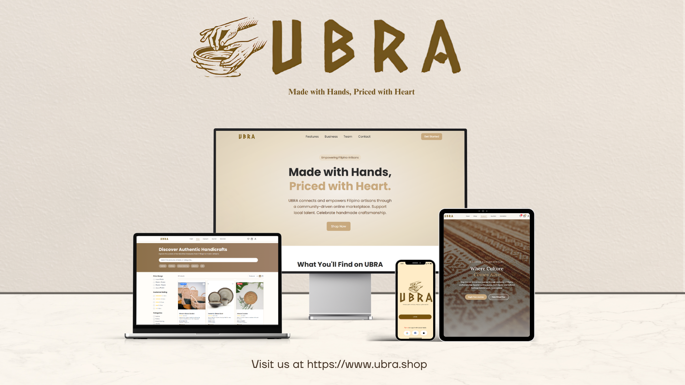

  

---

  <h1>About Me</h1>

  

    
  

  

    I am a <strong>Computer Science undergraduate</strong> specializing in <strong>full stack web development</strong>.  
    Currently, I focus on the <strong>MERN stack</strong> and modern JavaScript frameworks, building projects to strengthen both frontend and backend skills.
    Beyond coding, I enjoy <strong>photography</strong>, <strong>motorcycle rides</strong>, <strong>nature trips</strong>, and exploring <strong>new coffee spots</strong>.  
    These interests fuel creativity and problem-solving in my development work.
    I am continuously expanding my technical skills while combining them with creativity and curiosity,  
    aiming to contribute to <strong>meaningful and innovative applications</strong> in the future.
  

---

  
  
  
  

---

<h3 align="center"><strong>Currently Learning</strong></h3>

---
<h3 align="center"><strong>Programming Languages</strong></h3>

  
  
  
  
  
  
  

<h3 align="center"><strong>Frontend</strong></h3>

  
  
  
  
  

<h3 align="center"><strong>Backend</strong></h3>

  
  
  

<h3 align="center"><strong>Databases</strong></h3>

  
  
  

<h3 align="center"><strong>Version Control & Tools</strong></h3>

  
  
  
  
  
  
   
  

---

<h2 align="center">My Projects</h2>

  
   
  <a href="https://ubra.shop" target="_blank" style="text-decoration: none; color: #1E90FF;">
    <strong>UBRA Startup</strong>
  </a>
   
  <em>Philippine national startup qualifier and Regional Champion showcasing innovative features and responsive design.</em>

  
   
  <a href="https://gasmenfuneral.online" target="_blank" style="text-decoration: none; color: #1E90FF;">
    <strong>GFP Website</strong>
  </a>
   
  <em>Business website I built to increase online presence and customer engagement.</em>

---
<h2 align="center"><strong>Contact Me</strong></h2>

  

  <a href="mailto:kengasmen@gmail.com" style="margin: 0 25px;">
    
      📧 kengasmen@gmail.com
    
  </a>

  
    📞 +63-966-149-0595
  

---

### Resume
Resume: coming soon  

---

<h2 align="center"><strong>GitHub Activity Graph</strong></h2>
 

  

