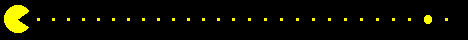

<!-- 
╔════════════════════════════════════════════════════════════════════╗
║                                                                    ║
║   ██╗  ██╗███████╗███╗   ██╗███╗   ██╗███████╗████████╗██╗  ██╗    ║
║   ██║ ██╔╝██╔════╝████╗  ██║████╗  ██║██╔════╝╚══██╔══╝██║  ██║    ║
║   █████╔╝ █████╗  ██╔██╗ ██║██╔██╗ ██║█████╗     ██║   ███████║    ║
║   ██╔═██╗ ██╔══╝  ██║╚██╗██║██║╚██╗██║██╔══╝     ██║   ██╔══██║    ║
║   ██║  ██╗███████╗██║ ╚████║██║ ╚████║███████╗   ██║   ██║  ██║    ║
║   ╚═╝  ╚═╝╚══════╝╚═╝  ╚═══╝╚═╝  ╚═══╝╚══════╝   ╚═╝   ╚═╝  ╚═╝    ║
║                                                                    ║
╚════════════════════════════════════════════════════════════════════╝
-->

<div align="center">
  
  <!-- ═══════════════════════════════════════════════════════════════════════════ -->
  <!-- 🎯 ANIMATED HEADER                                                          -->
  <!-- ═══════════════════════════════════════════════════════════════════════════ -->
  
  <a href="https://git.io/typing-svg">
    ;Full+Stack+Web+Developer;Turning+Ideas+Into+Reality;Code+%7C+Coffee+%7C+Create;Always+Learning+%26+Building" alt="Typing SVG"/>
  </a>
  

<!-- ═══════════════════════════════════════════════════════════════════════════ -->
<!-- 🖥️ INTRO GIF SECTION                                                        -->
<!-- ═══════════════════════════════════════════════════════════════════════════ -->

<div align="center">
  
</div>

<br/>

<div align="center">
  
</div>

<br/>

<!-- ═══════════════════════════════════════════════════════════════════════════ -->
<!-- 👤 ABOUT ME SECTION                                                          -->
<!-- ═══════════════════════════════════════════════════════════════════════════ -->

<div align="center">
  
</div>


<table>
<tr>
<td width="55%" valign="top">

</br>

```yaml
Name: Kenneth Gasmen
Location: Philippines
Status: Computer Science Undergraduate

Current Skills:
  - Full Stack Web Development
  - MERN Stack Architecture
  - Modern JavaScript Frameworks
  - Frontend & Backend Design
  - Database Integration

Currently Building:
  - Next-gen Web Applications
  - Scalable Business Solutions
  - Developer Tools & Utilities

Life Philosophy: "If you have a problem, 
                  I have the solution."
```

</td>
<td width="45%" valign="top">
  
### Current Focus

- **Mastering** MERN stack development
- **Building** full-stack applications
- **Exploring** RESTful APIs & Node.js
- **Learning** DevOps & deployment
- **Diving into** AI & Machine Learning
- **Creating** real-world projects


### Quick Facts

- Computer Science student
- Passionate about web technology
- Always learning & growing
- Fueled by coffee & curiosity

</td>
</tr>
</table>


<div align="center">

  
<h3><strong>Currently Learning & Building</strong></h3>


<br/>

<a href="https://github.com/kenth-dev">
  
</a>
&nbsp;
<a href="https://github.com/kenth-dev">
  
</a>
&nbsp;
<a href="https://github.com/kenth-dev">
  
</a>

</div>

<br/>

<div align="center">
  
</div>

<br/>


<!-- ═══════════════════════════════════════════════════════════════════════════ -->
<!-- 📊 GITHUB ANALYTICS                                                         -->
<!-- ═══════════════════════════════════════════════════════════════════════════ -->

<div align="center">
  
</div>

<br/>

<div align="center">
  
  <!-- GitHub Stats + Streak in ONE ROW -->
  &nbsp;
  <a href="https://git.io/streak-stats">
    
  </a>
  
  <br/>

<div align="center">
  
  <!-- Pac-Man Contribution Graph -->
  <picture>
    <source media="(prefers-color-scheme: dark)" srcset="./assets/pacman-contributions.svg"/>
    <source media="(prefers-color-scheme: light)" srcset="./assets/pacman-contributions.svg"/>
    
  </picture>
  
  <br/>
  
  <sub>Watch Pac-Man devour my contributions!</sub>
  
</div>

<br/>

<div align="center">
  
</div>

<br/>


<!-- ═══════════════════════════════════════════════════════════════════════════ -->
<!-- 📝 END OF README                                                            -->
<!-- ═══════════════════════════════════════════════════════════════════════════ -->


